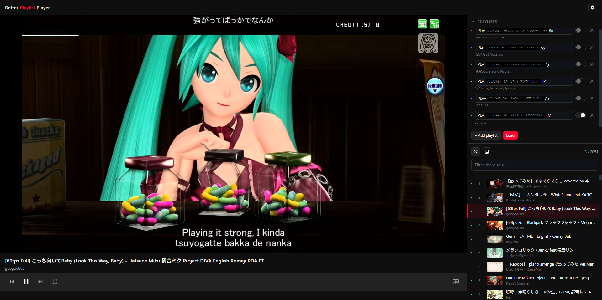

# Better Playlist Player

 

A player for YouTube playlists, with a shuffle that is actually random. 

No build step, no dependencies, and no account needed.

**The problem:** 
YouTube's shuffle doesn't shuffle the playlist. 
It picks a *next* track semi-randomly each time, so on a long playlist the same handful of tracks keep coming back while others go unplayed for hours.

**The fix:** 
This player shuffles the whole queue once, up front, with a fair Fisher–Yates shuffle, then plays every track exactly once before drawing a new order. You can also merge several playlists into one queue and shuffle across all of them. See [The shuffle](#the-shuffle) for the details.

**With or without an API key:** 
It works without one. An optional YouTube Data API key makes it better:

- **Without a key**, playlists are read through a hidden YouTube embed. That
  caps each playlist at roughly **200 tracks**, and the queue starts out
  showing video IDs. Titles fill in over the next few seconds, or as each
  track plays.
- **With a key**, playlists load **in full** and titles arrive with the
  tracks.

The key is free from the Google Cloud console; see
[API key (optional)](#api-key-optional) for setup.

## Running it

Double-click **`serve.cmd`**, or:

```
npm start           # node tools/serve.mjs
npm test            # node --test
```

It serves the folder at `http://localhost:8123` and opens a browser. 
To change the port, set `PORT=` in `.env` or pass it as an argument (`node tools/serve.mjs 9000`). 
The argument wins. `--no-open` skips the browser.
The port is read once at startup, so changing it needs a restart.

**It has to be served:** 
Opening `index.html` off the disk shows a notice instead of the app. 
The code is split into ES modules, and browsers refuse to load those over `file://`. 
The bundled server is plain Node with no dependencies. 
`serve.cmd` falls back to Python if Node is missing.

## Using it

1. Paste a playlist ID or any YouTube URL containing `list=`.
2. **+ Add playlist** for as many more as you want. Each gets a colour, shown
   as a dot beside every track it contributed.
3. **Load**.

Playlists, queue, and position are saved to `localStorage`, so reopening puts you back where you were. Press **Load** again to re-fetch. 
The per-playlist switch excludes a source from the next load without deleting the ID. 
If a playlist loads but stops early, its tracks are kept, and a warning appears under it in the sidebar.

`Space` play/pause
`N` next
`P` previous
`S` shuffle
`←` `→` seek 5s 
`M` mute (audio-only mode)

Repeat cycles **off -> all -> one**, starting at *all*. 
With repeat off, playback stops at the end of the queue.

The screen button drops the video and keeps the audio. 
A seek bar, a mute button and a volume slider appear alongside it, since hiding the video takes
YouTube's own controls with it. 
With the video showing, `M` is left to YouTube's player.

The queue panel can hide thumbnails. 
Settings also has **Clear title cache** (playlists and queue are kept) and **Reset everything** (clears playlists, queue and the typed key; a `.env` key and the title cache survive).

## Project layout

```
index.html            Markup only. No logic, no styles
serve.cmd             Double-click launcher
package.json          Scripts only. No dependencies
.env                  Your API key and port (gitignored)
.env.example          Template, committed

src/css/
  base.css            Design tokens, reset, utilities
  components.css      Buttons, inputs, toggles, toast
  layout.css          App shell, columns, playlist rows
  player.css          Video stage, seek bar, transport
  queue.css           The queue panel

src/js/
  main.js             Entry point. boots everything
  config.js           Tunable constants
  events.js           Tiny pub/sub
  utils.js            DOM and formatting helpers
  storage.js          localStorage that never throws
  env.js              Fetches /api/config for the .env key
  shuffle.js          randInt, fisherYates
  titles.js           Title cache and oEmbed backfill
  playlists.js        ID parsing, and the two extraction paths
  state.js            App state, persistence, play-order building
  youtube.js          IFrame API loading
  playback.js         The player and queue position
  loader.js           Sources -> queue orchestration
  ui/                 Sources, queue, nowplaying, controls
  ui/queue-window.js  Virtualised-queue maths, DOM-free and tested

test/                 node --test, no framework
tools/serve.mjs       Dependency-free static server
```

Two rules keep the dependency graph acyclic: nothing in `src/js/` imports `src/js/ui/` except the entry point `main.js`, and modules communicate outward through `events.js`. `shuffle.js` imports nothing at all, which is what makes it directly testable.

The queue list is **virtualised**: only the visible rows exist in the DOM, with a spacer above and below sized so the scrollbar still describes the whole queue.
A few thousand tracks rendered in full is ~10,000 elements, and at that size the browser stalls on things unrelated to the app (hovering, right-clicking) because each one walks the tree. The trade is that find-in-page only sees what is on screen. The filter box above the list searches the model instead.

## The shuffle

This is the part YouTube gets wrong. 
Its shuffle picks a *next* track semi-randomly each time, so some tracks resurface constantly while others go untouched for hours.

This one generates a **full permutation up front** ([`src/js/shuffle.js`](src/js/shuffle.js)):

- **Fisher–Yates** across the whole queue, so all `n!` orderings are equally likely.
- Randomness from **`crypto.getRandomValues`**, not `Math.random()`, with **rejection sampling** so there is no modulo bias toward low indices.
- The permutation is played through **completely** before anything repeats.
  Only when the queue plays out on its own (with repeat on *all*) is a fresh one drawn, and it will not open with the track that just finished.

### Tested

`npm test` runs tests, no framework. Beyond the obvious cases:

| Test | Result |
|---|---|
| Every item reaches every slot equally (120,000 shuffles of 6) | worst cell 1.7% off uniform |
| 5000-item shuffle is a true permutation, input unmutated | pass |
| `randInt` bias check across 90,000 draws | under 4% |
| Toggling shuffle redraws the order and loses nothing | pass |

## API key (optional)

Put it in **`.env`**:

```
YOUTUBE_API_KEY=AIza...
```

Then reload the page. The server re-reads `.env` on every request, so no restart is needed. Settings will show `Loaded from .env`. A key typed into the Settings box overrides `.env`, which is handy for trying a different one without editing files.

A static page cannot read `.env` by itself. [`tools/serve.mjs`](tools/serve.mjs) parses it and exposes just the key at `GET /api/config`, which [`src/js/env.js`](src/js/env.js) fetches at boot. 

Two consequences:
- Under the Python fallback in `serve.cmd` there is no `/api/config`, so the `.env` key is ignored. 
  Use the Settings box instead, or install Node. It also ignores `PORT` and always uses 8123.
- `.env` keeps the key out of your source files, **not** out of the browser.
  It is delivered to the page and visible in devtools. That is inherent to a client-side app; restrict the key to the YouTube Data API in the Google console. The server refuses to serve dotfiles over HTTP (`/.env` -> 403), so it is not readable as a file.

Or skip `.env` entirely: Settings -> paste a key there.

|  | No key | With key |
|---|---|---|
| How playlists are read | Cued into a hidden embed, IDs read back | Data API `playlistItems` |
| Playlist length | ~200 items (YouTube's embed cap) | Full |
| Titles | Backfilled via oEmbed, else as tracks play | Arrive with the videos |

Get one at [console.cloud.google.com](https://console.cloud.google.com/) -> enable *YouTube Data API v3* -> create an API key. 
It is stored only in your browser's `localStorage`.

Without a key, the embed returns video IDs and nothing else, so the queue first paints with raw IDs like `dQw4w9WgXcQ`. 
Names then arrive from the cache (instant), oEmbed (seconds, and blockable), or the player itself as each track starts (always works, one at a time).

## Limitations

These are YouTube's, not the player's:

- **Watch Later** and **Liked Videos** cannot be embedded at all.
- Private playlists will not load. Unlisted ones will.
- Some videos are blocked from embedding. Those are struck through in the
  queue and skipped automatically.
- Without an API key, playlists are capped at roughly 200 items.
